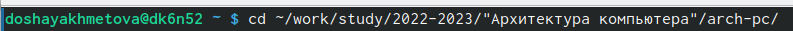
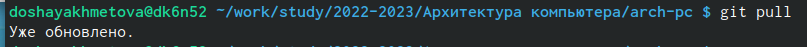
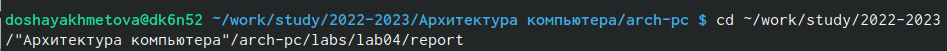
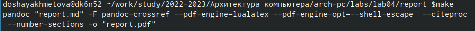
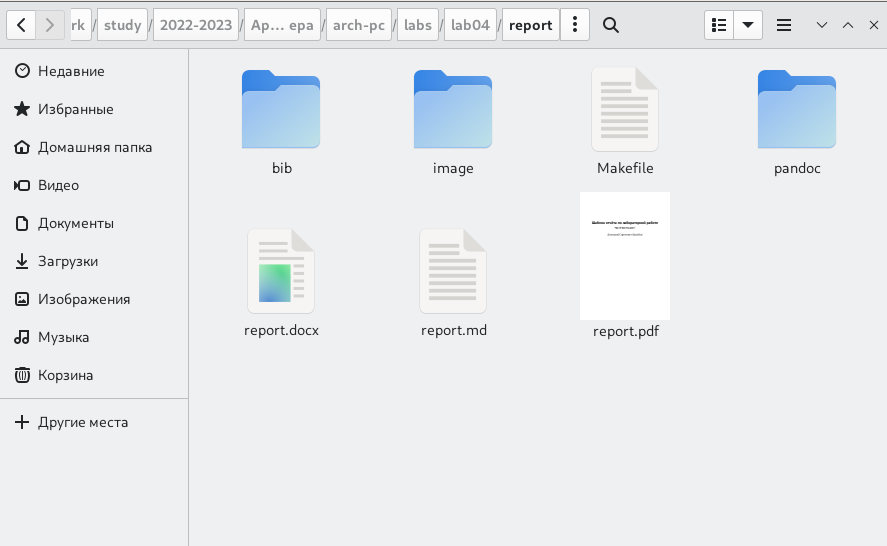
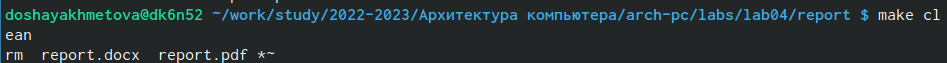
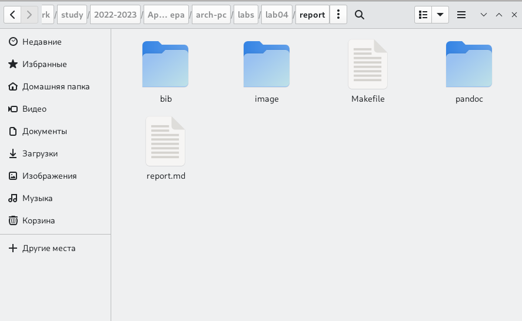
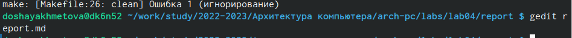

---
## Front matter
title: "Отчет по лабораторной работе №3"
subtitle: "Архитектура вычеслительных систем"
author: "Диана Олеговна Шаяхметова"

## Generic otions
lang: ru-RU
toc-title: "Содержание"

## Bibliography
bibliography: bib/cite.bib
csl: pandoc/csl/gost-r-7-0-5-2008-numeric.csl

## Pdf output format
toc: true # Table of contents
toc-depth: 2
lof: true # List of figures
lot: true # List of tables
fontsize: 12pt
linestretch: 1.5
papersize: a4
documentclass: scrreprt
## I18n polyglossia
polyglossia-lang:
  name: russian
  options:
	- spelling=modern
	- babelshorthands=true
polyglossia-otherlangs:
  name: english
## I18n babel
babel-lang: russian
babel-otherlangs: english
## Fonts
mainfont: PT Serif
romanfont: PT Serif
sansfont: PT Sans
monofont: PT Mono
mainfontoptions: Ligatures=TeX
romanfontoptions: Ligatures=TeX
sansfontoptions: Ligatures=TeX,Scale=MatchLowercase
monofontoptions: Scale=MatchLowercase,Scale=0.9
## Biblatex
biblatex: true
biblio-style: "gost-numeric"
biblatexoptions:
  - parentracker=true
  - backend=biber
  - hyperref=auto
  - language=auto
  - autolang=other*
  - citestyle=gost-numeric
## Pandoc-crossref LaTeX customization
figureTitle: "Рис."
tableTitle: "Таблица"
listingTitle: "Листинг"
lofTitle: "Список иллюстраций"
lotTitle: "Список таблиц"
lolTitle: "Листинги"
## Misc options
indent: true
header-includes:
  - \usepackage{indentfirst}
  - \usepackage{float} # keep figures where there are in the text
  - \floatplacement{figure}{H} # keep figures where there are in the text
---

# Цель работы

Целью работы является освоение процедуры оформления отчетов с помощью
легковесного языка разметки Markdown

# Задание

1. В соответствующем каталоге сделайте отчёт по лабораторной работе No 3
в формате Markdown. В качестве отчёта необходимо предоставить отчёты
в 3 форматах: pdf, docx и md.
2. Загрузите файлы на github.

# Теоретическое введение

# Выполнение лабораторной работы

1 Открываем терминал, переходим в каталог курса и обновляем локальный репозиторий с помощью команды git pull

{ #fig:001 width=90% }
{ #fig:002 width=90% }

2 Переходим в каталог с шаблонами отчета по лабораторной №4

{ #fig:003 width=90% }

3 Проводим компеляцию шаблона с использованием Makelife с помощью команды "make"

{ #fig:004 width=90% }

4 Заходим в каталог файла, затем в подкаталог лабораторной работы №4 и проверяем на наличие файлов.

{ #fig:005 width=90% }

5 Удаляем полученные файлы с помощью команды rm и проверяем  подкаталоге, что файлы удалились.

{ #fig:006 width=90% }
{ #fig:007 width=90% }

6 Открываем файл report.md с помощью текстового редактора gedit

{ #fig:008 width=90% }

# Выводы

Я научилась работать с makefile и смогла сделать отчет

# Список литературы{.unnumbered}

::: {#refs}
:::

