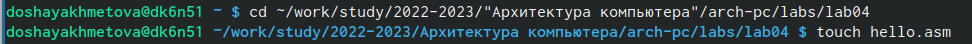
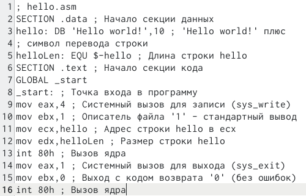
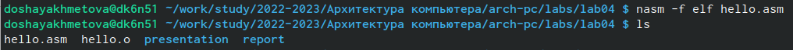
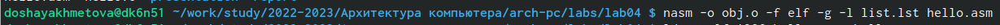
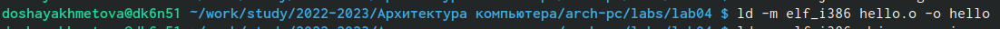
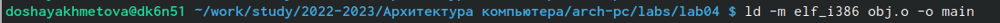
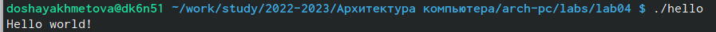
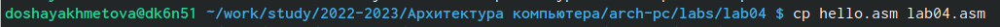
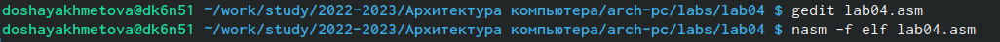
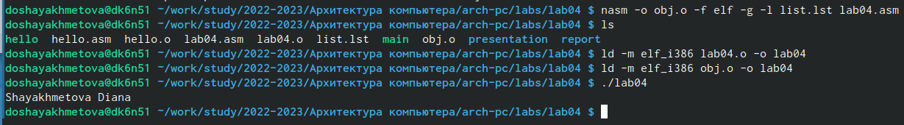

---
## Front matter
title: "Отчет по лабораторной работе №4"
subtitle: "Архитектура вычеслительных систем"
author: "Диана Олеговна Шаяхметова"

## Generic otions
lang: ru-RU
toc-title: "Содержание"

## Bibliography
bibliography: bib/cite.bib
csl: pandoc/csl/gost-r-7-0-5-2008-numeric.csl

## Pdf output format
toc: true # Table of contents
toc-depth: 2
lof: true # List of figures
lot: true # List of tables
fontsize: 12pt
linestretch: 1.5
papersize: a4
documentclass: scrreprt
## I18n polyglossia
polyglossia-lang:
  name: russian
  options:
	- spelling=modern
	- babelshorthands=true
polyglossia-otherlangs:
  name: english
## I18n babel
babel-lang: russian
babel-otherlangs: english
## Fonts
mainfont: PT Serif
romanfont: PT Serif
sansfont: PT Sans
monofont: PT Mono
mainfontoptions: Ligatures=TeX
romanfontoptions: Ligatures=TeX
sansfontoptions: Ligatures=TeX,Scale=MatchLowercase
monofontoptions: Scale=MatchLowercase,Scale=0.9
## Biblatex
biblatex: true
biblio-style: "gost-numeric"
biblatexoptions:
  - parentracker=true
  - backend=biber
  - hyperref=auto
  - language=auto
  - autolang=other*
  - citestyle=gost-numeric
## Pandoc-crossref LaTeX customization
figureTitle: "Рис."
tableTitle: "Таблица"
listingTitle: "Листинг"
lofTitle: "Список иллюстраций"
lotTitle: "Список таблиц"
lolTitle: "Листинги"
## Misc options
indent: true
header-includes:
  - \usepackage{indentfirst}
  - \usepackage{float} # keep figures where there are in the text
  - \floatplacement{figure}{H} # keep figures where there are in the text
---

# Цель работы

Целью работы является освоение процедуры компиляции и сборки программ, написанных на асссемблере NASM.

# Задание

1. В каталоге ~/work/arch-pc/lab05 с помощью команды cp создайте копию
файла hello.asm с именем lab5.asm

2. С помощью любого текстового редактора внесите изменения в текст про-
граммы в файле lab5.asm так, чтобы вместо Hello world! на экран выво-
дилась строка с вашими фамилией и именем.

3. Оттранслируйте полученный текст программы lab5.asm в объектный
файл. Выполните компоновку объектного файла и запустите получивший-
ся исполняемый файл.

4. Скопируйте файлы hello.asm и lab5.asm в Ваш локальный репозиторий
в каталог ~/work/study/2022-2023/"Архитектура компьютера"/arch-
pc/labs/lab05/. Загрузите файлы на Github.

# Теоретическое введение

# Выполнение лабораторной работы

1.  Переходим в каталог lab04 и создаем текстовый файл с именем hello.asm.

{ #fig:001 width=90% }

2. Открываем этот файл с помощью gedit.

{ #fig:002 width=90% }

3.  Вводим данный текст.

{ #fig:003 width=90% }

4.  Компилируем данный текст и проверяем, что файлы созданы с помощью команды ls.

{ #fig:004 width=90% }

5. Компилируем файл hello.asm в obj.o.

{ #fig:005 width=90% }

6.  Чтобы получить исполняемую программу, передаем объектный файл на обработку компоновщику.

{ #fig:006 width=90% }

7.  Вводим команду main и получаем переименованный файл.

{ #fig:007 width=90% }

8. Запускаем на выполнение созданный исполняемый файл.

{ #fig:008 width=90% }

# Самостоятельная работа

1. С помощью команды cp создаем копию файла hello.asm и переименовываем его в lab04.asm.

{ #fig:009 width=90% }

2. В gedit вносим изменения в текст программы файла, заменяя Hello World на свои фамилию и имя, транслируем полученный текст в объектный файл, выполняем его компоновку и запускаем получившийся файл.

{ #fig:010 width=90% }
{ #fig:011 width=90% }

# Выводы

Я освоила процедуру компиляции и сборки программ, написанных в ассемблере NASM.

# Список литературы{.unnumbered}

::: {#refs}
:::

