---
## Front matter
title: "Отчет по лабораторной работе №5"
subtitle: "Архитектура вычеслительных систем"
author: "Диана Олеговна Шаяхметова"

## Generic otions
lang: ru-RU
toc-title: "Содержание"

## Bibliography
bibliography: bib/cite.bib
csl: pandoc/csl/gost-r-7-0-5-2008-numeric.csl

## Pdf output format
toc: true # Table of contents
toc-depth: 2
lof: true # List of figures
lot: true # List of tables
fontsize: 12pt
linestretch: 1.5
papersize: a4
documentclass: scrreprt
## I18n polyglossia
polyglossia-lang:
  name: russian
  options:
	- spelling=modern
	- babelshorthands=true
polyglossia-otherlangs:
  name: english
## I18n babel
babel-lang: russian
babel-otherlangs: english
## Fonts
mainfont: PT Serif
romanfont: PT Serif
sansfont: PT Sans
monofont: PT Mono
mainfontoptions: Ligatures=TeX
romanfontoptions: Ligatures=TeX
sansfontoptions: Ligatures=TeX,Scale=MatchLowercase
monofontoptions: Scale=MatchLowercase,Scale=0.9
## Biblatex
biblatex: true
biblio-style: "gost-numeric"
biblatexoptions:
  - parentracker=true
  - backend=biber
  - hyperref=auto
  - language=auto
  - autolang=other*
  - citestyle=gost-numeric
## Pandoc-crossref LaTeX customization
figureTitle: "Рис."
tableTitle: "Таблица"
listingTitle: "Листинг"
lofTitle: "Список иллюстраций"
lotTitle: "Список таблиц"
lolTitle: "Листинги"
## Misc options
indent: true
header-includes:
  - \usepackage{indentfirst}
  - \usepackage{float} # keep figures where there are in the text
  - \floatplacement{figure}{H} # keep figures where there are in the text
---

# Цель работы

Целью работы является приобретение практических навыков работы Midnight Commander, освоение инструкций языка ассемблера mov и int.

# Задание

 1. Создайте копию файла lab6-1.asm. Внесите изменения в программу (без
использования внешнего файла in_out.asm), так чтобы она работала по
следующему алгоритму:
• вывести приглашение типа “Введите строку:”;
• ввести строку с клавиатуры;
• вывести введённую строку на экран.
 2. Получите исполняемый файл и проверьте его работу. На приглашение
ввести строку введите свою фамилию.
 3. Создайте копию файла lab6-2.asm. Исправьте текст программы с исполь-
зование подпрограмм из внешнего файла in_out.asm, так чтобы она ра-
ботала по следующему алгоритму:
• вывести приглашение типа “Введите строку:”;
• ввести строку с клавиатуры;
• вывести введённую строку на экран.
Не забудьте, подключаемый файл in_out.asm должен лежать в том же
каталоге, что и файл с программой, в которой он используется.
 4. Создайте исполняемый файл и проверьте его работу.

# Теоретическое введение

# Выполнение лабораторной работы

1.  Открываем Midnight commander и переходим в каталог ~/work/arch-pc 

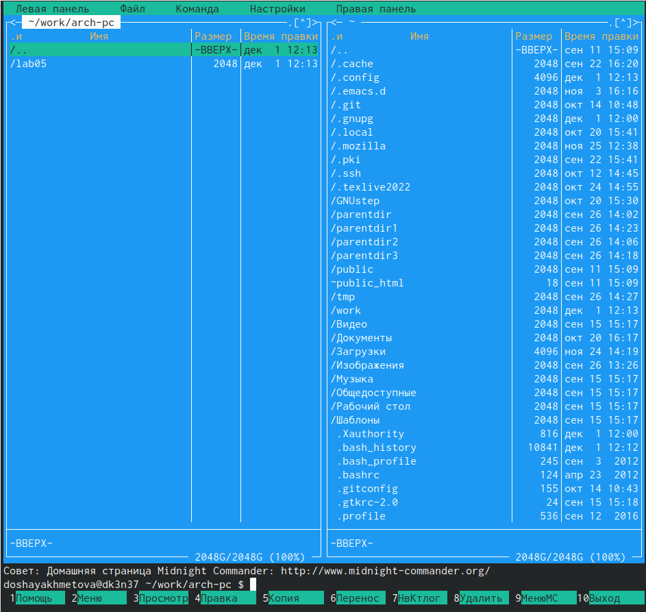{ #fig:001 width=90% }

2. Создаем папку lab06 и переходим в созданный каталог

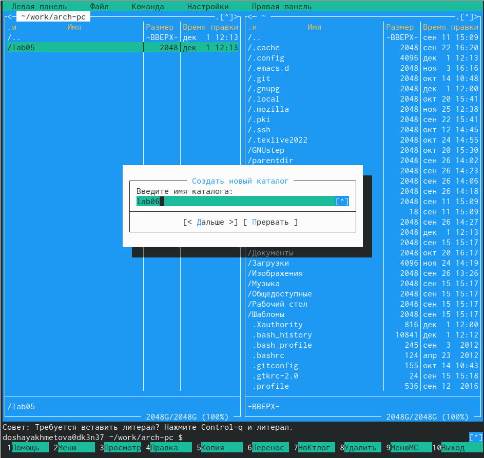{ #fig:002 width=90% }

3.  Пользуясь строкой ввода и командой touch создаем файл lab6-1.asm

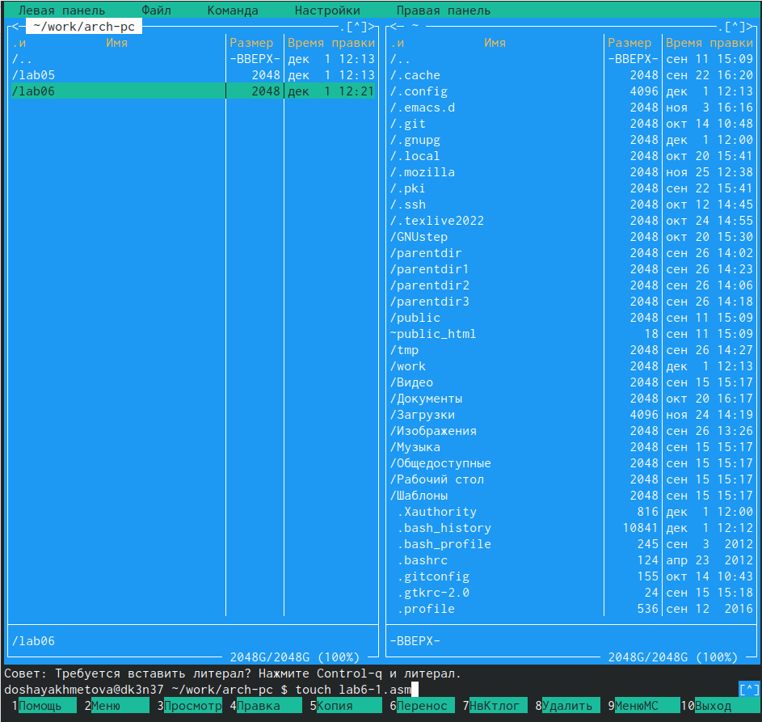{ #fig:003 width=90% }

4.  Вводим текст программы, сохраняем и закрываем файл

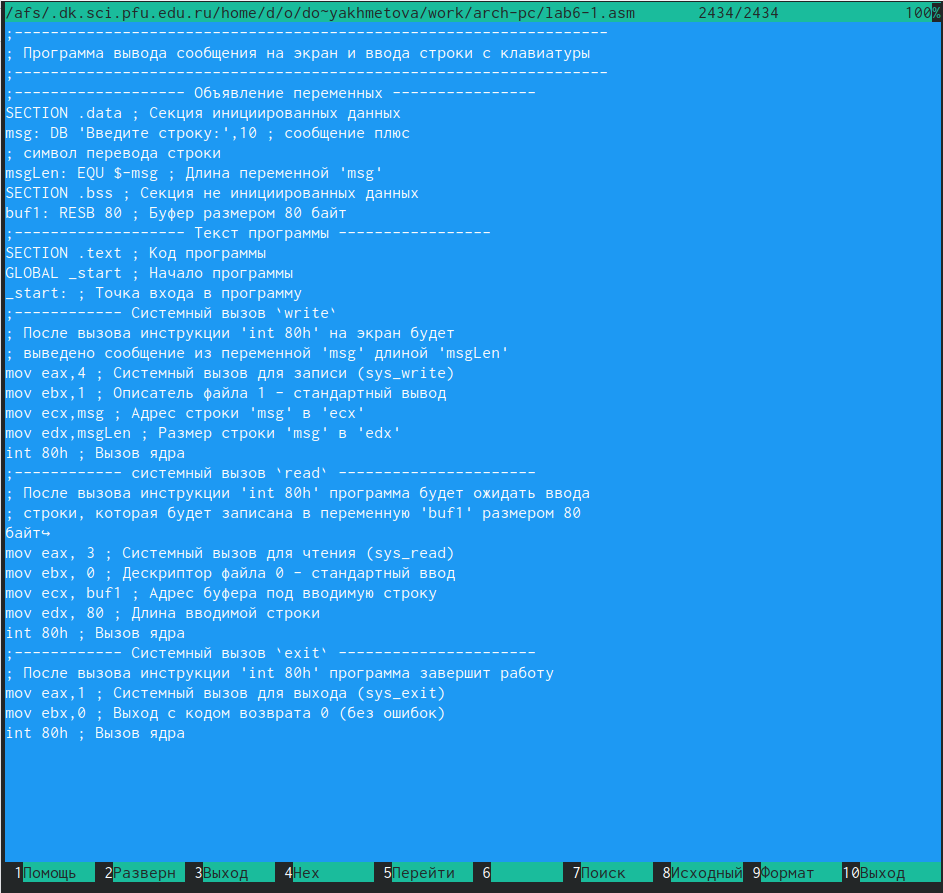{ #fig:004 width=90% }

5. Убедимся, что файл содержит текст программы 

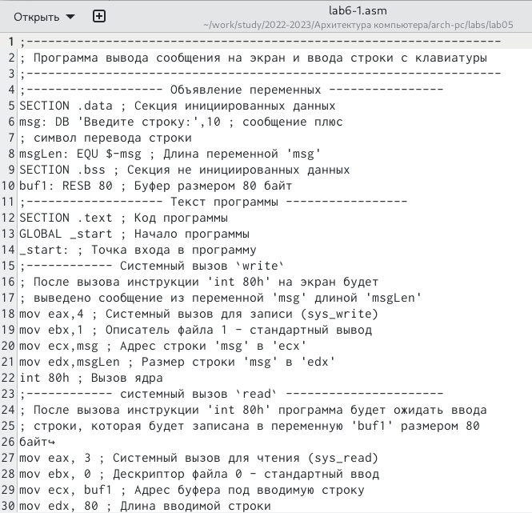{ #fig:005 width=90% }

6.  Выполняем оттранслировку и компоновку объектного файла и запускаем получившийся файл

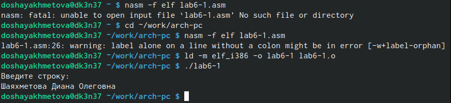{ #fig:006 width=90% }

7.  Создаем копию файла lab6-1.asm с именем lab6-2.asm, исправляем текст программы в файле lab6-2.asm в соответсвии с листингом 6.2

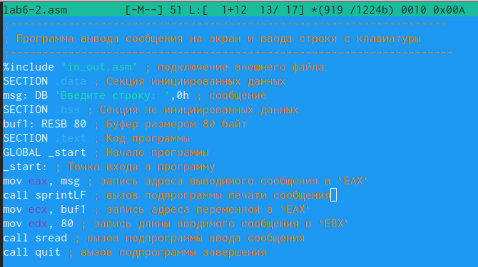{ #fig:007 width=90% }
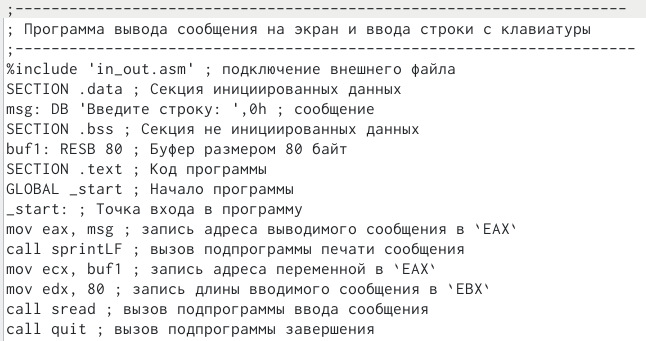{ #fig:008 width=90% }

8. Создаем исполняемый файл и проверяем его работу

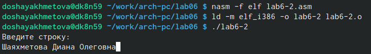{ #fig:009 width=90% }

9. Заменяем подпрограмму sprintLF на sprint в файле lab6-2.asm, создаем исполняемый файл и проверяем его работу

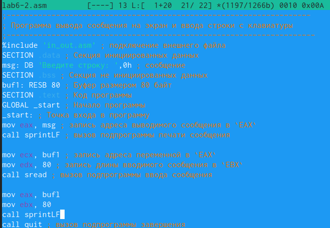{ #fig:010 width=90% }
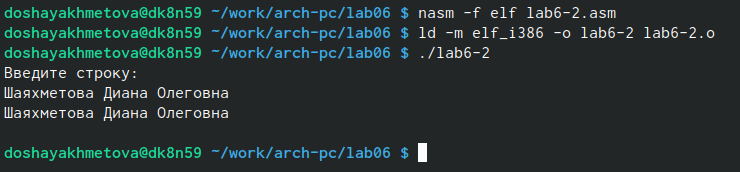{ #fig:011 width=90% }

# Выводы

Я приобрела практические навыки работы в Midnight Commander и освоила инструкции языка ассемблера mov и int.

# Список литературы{.unnumbered}

::: {#refs}
:::

